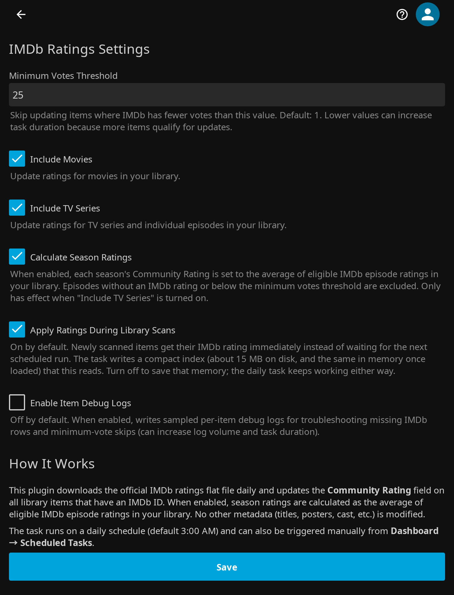

<p align="center">
  
</p>

# Jellyfin IMDb Ratings

<p align="center">
  <a href="https://github.com/voc0der/jellyfin-plugin-imdb-ratings/releases/latest">
    
  </a>
  <a href="https://github.com/voc0der/jellyfin-plugin-imdb-ratings/tree/main/tests">
    
  </a>
  <a href="https://github.com/voc0der/jellyfin-plugin-imdb-ratings/issues">
    
  </a>
  <a href="LICENSE">
    
  </a>
  <a href="https://github.com/voc0der/jellyfin-plugin-imdb-ratings/network/dependencies">
    
  </a>
</p>

A Jellyfin plugin that downloads the [IMDb ratings flat file](https://datasets.imdbws.com/title.ratings.tsv.gz) daily and updates `CommunityRating` on all library items with an IMDb ID. No other metadata is touched.

<p align="center">
  
</p>
<p align="center">
  <em>Configuration page inside the Jellyfin dashboard</em>
</p>

## Features

- Daily scheduled task (default 3 AM), also triggerable manually from Dashboard
- Downloads and caches the ~2MB compressed IMDb dataset with 23-hour cache
- Batch processing tuned to finish in well under a minute even for massive libraries
- Configurable minimum votes threshold (default: 1)
- Choose which library types to update (Movies, TV Series, or both)
- Season ratings (opt-in) calculated as the average of eligible IMDb episode ratings in your library
- Progress reporting in the Jellyfin task UI

## Installation

### From Plugin Repository

1. In Jellyfin, go to **Dashboard > Plugins > Repositories**
2. Add: `https://raw.githubusercontent.com/voc0der/jellyfin-plugin-imdb-ratings/main/manifest.json`
3. Install **IMDb Ratings** from the catalog

> [!NOTE]
> Full repository of this author's plugins: [voc0der/jellyfin-plugins](https://github.com/voc0der/jellyfin-plugins).

### Manual

1. Download the latest release ZIP
2. Extract to your Jellyfin plugins directory
3. Restart Jellyfin

#### Building from source

```bash
dotnet build --configuration Release
```

## Configuration

Go to **Dashboard > Plugins > IMDb Ratings**:

The daily run time is configured in **Dashboard > Scheduled Tasks**; `3:00 AM` is only the default.

- **Minimum Votes** — skip items with fewer IMDb votes than this (default: 1)
- **Include Movies** — update movie ratings
- **Include TV Series** — update series and episode ratings
- **Calculate Season Ratings** — set each season's rating to the average of eligible IMDb episode ratings in your library; episodes without IMDb data or below the votes threshold are excluded (requires Include TV Series, default: off)
